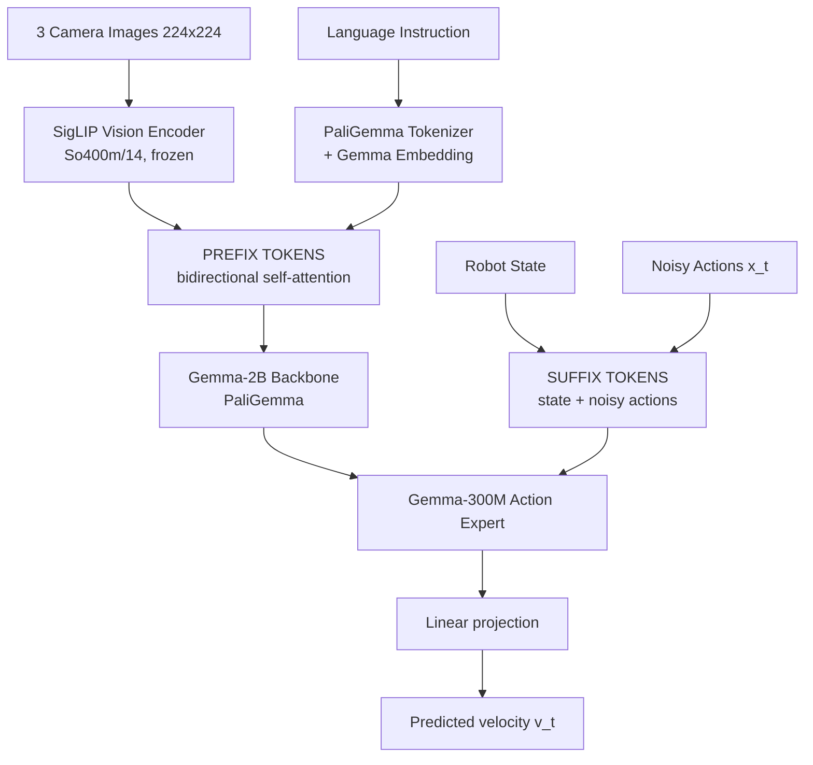
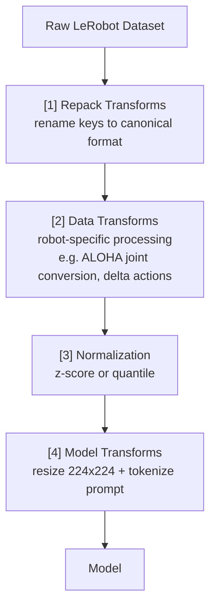

# PI0 (RoboTwin)

## 1. Overview

**PI0** (*Physical Intelligence 0*) is a vision-language-action (VLA) model that generates robot actions conditioned on camera images and language instructions. The core training algorithm is **Flow Matching** — a continuous-time generative modeling technique closely related to [[Diffusion Policy|diffusion models]], but formulated as learning a velocity field that transports noise to the data distribution.

> [!info] Related notes
> - Paper: [[Pi0]]
> - Related VLA: [[OpenVLA]], [[OpenVlaOft]]
> - Generative backbone: [[Diffusion Policy]]

---

## 2. Architecture

### 2.1 High-Level Structure

**Inputs**
- 3 camera images (`base`, `left_wrist`, `right_wrist`) @ 224×224
- Language instruction (tokenized prompt)
- Robot proprioceptive state (joint angles / positions)



### 2.2 Component Details

| Component                   | Implementation                                | Role                                                          |
| --------------------------- | --------------------------------------------- | ------------------------------------------------------------- |
| **SigLIP** (`siglip.py`)    | `So400m/14`, output projected to 2048-dim     | Encodes each camera image into a sequence of patch tokens     |
| **PaliGemma LLM**           | Gemma-2B (18 layers, 8 heads, 2048 hidden)    | Joint reasoning over image + language prefix                  |
| **Action Expert**           | Gemma-300M (separate smaller transformer)     | Processes state + noisy actions in the suffix                 |
| **State Projector**         | `Linear(action_dim → expert_width)`           | Projects robot state into a single embedding token            |
| **Action Input Projector**  | `Linear(action_dim → expert_width)`           | Projects each noisy action step into embedding space          |
| **Timestep Embedding**      | Sinusoidal positional encoding (4e-3 → 4.0)   | Encodes the diffusion timestep $t$ as a vector                |
| **Action–Time MLP**         | 2-layer MLP with SiLU activation              | Fuses action embeddings with timestep information             |
| **Action Output Projector** | `Linear(expert_width → action_dim)`           | Maps transformer output back to action space                  |

**Corresponding code** (`src/openpi/models/pi0.py`):

```python
class Pi0(BaseModel):
    def __init__(self, config, rngs):
        # PaliGemma = SigLIP encoder + Gemma-2B backbone
        self.PaliGemma = nnx.Dict(llm=..., img=...)
        # Suffix projections for action expert
        self.state_proj         = Linear(action_dim   -> expert_width)
        self.action_in_proj     = Linear(action_dim   -> expert_width)
        self.action_time_mlp_in = Linear(2 * expert_width -> expert_width)
        self.action_time_mlp_out= Linear(expert_width -> expert_width)
        self.action_out_proj    = Linear(expert_width -> action_dim)
```

### 2.3 Attention Masking

The model uses a **prefix–suffix attention pattern**:

- **Prefix** (images + language): full bidirectional attention among all prefix tokens (`ar_mask = False`).
- **Suffix** (state + actions): the state token starts a new causal block (`ar_mask = True`); the action tokens attend to all prefix + state tokens bidirectionally (`ar_mask = False` after the first suffix token).
- Prefix tokens **cannot** attend to suffix tokens (enforced by the cumulative `ar_mask` mechanism).

**Corresponding code** (`src/openpi/models/pi0.py:20-45`):

```python
def make_attn_mask(input_mask, mask_ar):
    cumsum = jnp.cumsum(mask_ar, axis=1)
    attn_mask = cumsum[:, None, :] <= cumsum[:, :, None]
    valid_mask = input_mask[:, None, :] * input_mask[:, :, None]
    return jnp.logical_and(attn_mask, valid_mask)
```

---

## 3. Training Algorithm: Flow Matching

### 3.1 Mathematical Formulation

Flow matching learns a **velocity field** $v(x, t)$ that defines an ODE transporting samples from a noise distribution ($t=1$) to the data distribution ($t=0$).

Given:
- $a$ — ground-truth action sequence (from demonstrations)
- $\epsilon \sim \mathcal{N}(0, I)$ — random Gaussian noise
- $t \sim \mathrm{Beta}(1.5, 1) \cdot 0.999 + 0.001$ — random timestep in $(0, 1]$

The **interpolated (noisy) action** at time $t$ is:

$$
x_t = t \cdot \epsilon + (1 - t) \cdot a
$$

The **target velocity** (what the model should predict) is the direction from data to noise:

$$
u_t = \epsilon - a
$$

The **training loss** is the mean-squared error between the predicted velocity $v_t$ and the target:

$$
\mathcal{L} = \mathbb{E}\left[\, \lVert v_t(x_t, t, \mathrm{obs}) - u_t \rVert^2 \,\right]
$$

### 3.2 Why Beta(1.5, 1) for Timestep Sampling?

> [!tip] Skewed timestep distribution
> The $\mathrm{Beta}(1.5, 1)$ distribution is skewed toward $t = 1$ (the noisy end). The model therefore trains more on **high-noise regimes**, which is where errors compound most during inference. The shift $\cdot 0.999 + 0.001$ keeps $t$ bounded away from exact 0 and 1.

### 3.3 Training Loss Code

**Corresponding code** (`src/openpi/models/pi0.py:228-257`):

```python
def compute_loss(self, rng, observation, actions, *, train=False):
    preprocess_rng, noise_rng, time_rng = jax.random.split(rng, 3)
    observation = preprocess_observation(preprocess_rng, observation, train=train)

    # Sample noise and timestep
    noise = jax.random.normal(noise_rng, actions.shape)
    time  = jax.random.beta(time_rng, 1.5, 1, batch_shape) * 0.999 + 0.001

    # Create noisy actions (linear interpolation)
    x_t = time * noise + (1 - time) * actions
    # Target velocity
    u_t = noise - actions

    # Forward pass: embed prefix (images+lang) and suffix (state+noisy_actions)
    prefix_tokens, prefix_mask, prefix_ar_mask = self.embed_prefix(observation)
    suffix_tokens, suffix_mask, suffix_ar_mask = self.embed_suffix(observation, x_t, time)

    # Combined transformer forward pass
    (prefix_out, suffix_out), _ = self.PaliGemma.llm(
        [prefix_tokens, suffix_tokens], mask=attn_mask, positions=positions
    )

    # Extract action predictions from suffix output
    v_t = self.action_out_proj(suffix_out[:, -action_horizon:])

    # MSE loss
    return jnp.mean(jnp.square(v_t - u_t), axis=-1)
```

---

## 4. Inference: ODE-Based Action Sampling

At inference time, actions are generated by solving an ODE from $t=1$ (pure noise) to $t=0$ (clean actions) using **Euler integration**.

### 4.1 Sampling Procedure

1. Sample initial noise: $x_1 \sim \mathcal{N}(0, I)$ with shape `[B, action_horizon, action_dim]`.
2. Cache the prefix (images + language) via a single forward pass to avoid recomputation.
3. Iteratively denoise using `num_steps` Euler steps (default `10`):
   ```
   for each step:
       v_t = model(x_t, t, observation)   # predict velocity
       x_t = x_t + dt * v_t                # Euler step (dt = -1/num_steps)
       t   = t + dt
   ```
4. Return $x_0$ as the predicted action sequence.

### 4.2 KV-Cache Optimization

> [!note] Why cache the prefix?
> During inference, the prefix forward pass is computed **once** and its key–value cache is reused for all denoising steps. Only the suffix (state + noisy actions) is re-embedded at each step.

**Corresponding code** (`src/openpi/models/pi0.py:260-316`):

```python
def sample_actions(self, rng, observation, *, num_steps=10):
    dt = -1.0 / num_steps
    noise = jax.random.normal(rng, (batch_size, action_horizon, action_dim))

    # Cache prefix KV
    prefix_tokens, prefix_mask, prefix_ar_mask = self.embed_prefix(observation)
    _, kv_cache = self.PaliGemma.llm([prefix_tokens, None], ...)

    def step(carry):
        x_t, time = carry
        suffix_tokens, ... = self.embed_suffix(observation, x_t, time)
        (_, suffix_out), _ = self.PaliGemma.llm(
            [None, suffix_tokens], ..., kv_cache=kv_cache
        )
        v_t = self.action_out_proj(suffix_out[:, -action_horizon:])
        return x_t + dt * v_t, time + dt

    x_0, _ = jax.lax.while_loop(cond, step, (noise, 1.0))
    return x_0
```

---

## 5. Training Loop

### 5.1 Initialization

**Corresponding code** (`scripts/train.py:220-267`):

1. Parse config via `tyro` CLI (selects one of the predefined configs like `pi0_base_aloha_robotwin_lora`).
2. Create data loader with transform pipeline.
3. Initialize model parameters from scratch, then **merge pre-trained weights** (e.g., from `s3://openpi-assets/checkpoints/pi0_base/params`).
4. Create optimizer (AdamW) and training state.
5. Optionally freeze parameters based on `freeze_filter` (for LoRA finetuning).
6. JIT-compile the training step with FSDP sharding.

### 5.2 Training Step

**Corresponding code** (`scripts/train.py:158-217`):

```python
def train_step(config, rng, state, batch):
    model = nnx.merge(state.model_def, state.params)

    # Compute loss and gradients (only for trainable params)
    diff_state = nnx.DiffState(0, config.trainable_filter)
    loss, grads = nnx.value_and_grad(loss_fn, argnums=diff_state)(model, rng, obs, actions)

    # Optimizer update
    updates, new_opt_state = state.tx.update(grads, state.opt_state, params)
    new_params = optax.apply_updates(params, updates)

    # EMA update (if enabled)
    ema_params = ema_decay * old_ema + (1 - ema_decay) * new_params

    return new_state, {"loss": loss, "grad_norm": ..., "param_norm": ...}
```

### 5.3 Main Loop

**Corresponding code** (`scripts/train.py:269-298`):

```python
for step in range(start_step, num_train_steps):
    train_state, info = ptrain_step(train_rng, train_state, batch)

    if step % log_interval == 0:
        # Log to wandb
        batch = next(data_iter)

    if step % save_interval == 0:
        # Save checkpoint
```

---

## 6. Data Pipeline

### 6.1 Transform Chain

Data flows through 4 stages of transforms before reaching the model:



Normalization options:
- **Z-score**: $(x - \mu) / (\sigma + 10^{-6})$
- **Quantile**: $(x - q_{01}) / (q_{99} - q_{01}) \cdot 2 - 1$

**Corresponding code** (`src/openpi/training/data_loader.py:109-126`):

```python
def transform_dataset(dataset, data_config):
    return TransformedDataset(dataset, [
        *data_config.repack_transforms.inputs,
        *data_config.data_transforms.inputs,
        Normalize(norm_stats, use_quantiles=...),
        *data_config.model_transforms.inputs,
    ])
```

### 6.2 Image Augmentation (Training Only)

During training, images are augmented in `preprocess_observation()`:

| Augmentation                                                | Non-wrist cameras | Wrist cameras |
| ----------------------------------------------------------- | :---------------: | :-----------: |
| Random crop (95%) + resize back                             |        ✅         |       ❌       |
| Random rotation (−5° to +5°)                                |        ✅         |       ❌       |
| Color jitter (brightness=0.3, contrast=0.4, saturation=0.5) |        ✅         |       ✅       |

**Corresponding code**: `src/openpi/models/model.py:136-200`

### 6.3 Data Format

```python
# Observation (model input)
Observation:
    images:               {"base_0_rgb": [B, 224, 224, 3], ...}  # float32, [-1, 1]
    image_masks:          {"base_0_rgb": [B], ...}               # bool
    state:                [B, 32]                                # float32, normalized
    tokenized_prompt:     [B, 48]                                # int32
    tokenized_prompt_mask:[B, 48]                                # bool

# Actions (model target)
actions: [B, 50, 32]   # float32, normalized
                       # 50 = action_horizon, 32 = action_dim
```

---

## 7. Optimization

### 7.1 Optimizer: AdamW

| Hyperparameter       | Value  |
| -------------------- | ------ |
| `beta1`              | 0.9    |
| `beta2`              | 0.95   |
| `epsilon`            | 1e-8   |
| `weight_decay`       | 1e-10  |
| `gradient_clip_norm` | 1.0    |

**Corresponding code** (`src/openpi/training/optimizer.py:69-93`):

```python
class AdamW:
    def create(self, lr, weight_decay_mask):
        tx = optax.adamw(lr, b1=0.9, b2=0.95, eps=1e-8, weight_decay=1e-10)
        return optax.chain(optax.clip_by_global_norm(1.0), tx)
```

### 7.2 Learning Rate Schedule: Cosine Decay with Warmup

```
LR
 ^
 |       peak_lr = 2.5e-5
 |        ┌────────┐
 |       /          \
 |      /            \________  decay_lr = 2.5e-6
 |     /
 +----+-------------+------------> step
 0   1000         30000
   warmup        decay
```

**Corresponding code** (`src/openpi/training/optimizer.py:17-33`):

```python
class CosineDecaySchedule:
    warmup_steps: int = 1_000
    peak_lr:    float = 2.5e-5
    decay_steps: int  = 30_000
    decay_lr:   float = 2.5e-6
```

### 7.3 Exponential Moving Average (EMA)

After each optimizer step, an EMA copy of the parameters is maintained:

$$
\theta_{\text{ema}} \leftarrow 0.99 \cdot \theta_{\text{ema}} + 0.01 \cdot \theta_{\text{new}}
$$

The EMA parameters are used for inference and checkpointing, providing smoother and more robust predictions.

---

## 8. LoRA Finetuning

For efficient adaptation, **LoRA** (Low-Rank Adaptation) is applied to the Gemma attention and feed-forward layers:

- **Frozen**: all `llm` parameters (Gemma-2B backbone + Gemma-300M action expert).
- **Trainable**: LoRA adapter weights (`.*lora.*` pattern), plus all non-LLM parameters (projections, `state_proj`, action MLPs).

This dramatically reduces the number of trainable parameters while preserving the pre-trained knowledge.

**Corresponding code** (`src/openpi/models/pi0.py:111-132`):

```python
def get_freeze_filter(self):
    # Freeze all LLM params except LoRA adapters
    filters = [PathRegex(".*llm.*"), Not(PathRegex(".*lora.*"))]
    return All(*filters)
```

---

## 9. RoboTwin-Specific Configuration

The RoboTwin project defines 4 training configs in `config.py:377-503`:

| Config Name                    | Model                  | Finetuning | FSDP Devices |
| ------------------------------ | ---------------------- | ---------- | :----------: |
| `pi0_base_aloha_robotwin_lora` | PI0 (Gemma-2B + 300M)  | LoRA       |      1       |
| `pi0_fast_aloha_robotwin_lora` | PI0-FAST (Gemma-2B)    | LoRA       |      2       |
| `pi0_base_aloha_robotwin_full` | PI0 (Gemma-2B + 300M)  | Full       |      4       |
| `pi0_fast_aloha_robotwin_full` | PI0-FAST (Gemma-2B)    | Full       |      1       |

> [!example] Shared settings
> All configs use `batch_size=32`, `num_train_steps=30000`, `adapt_to_pi=False`, `local_files_only=True`.

**Camera mapping**:
- `cam_high → base_0_rgb`
- `cam_left_wrist → left_wrist_0_rgb`
- `cam_right_wrist → right_wrist_0_rgb`

---

## 10. Compact Pseudocode

```text
=======================================================================
PI0 TRAINING - FLOW MATCHING FOR ROBOT ACTION GENERATION
=======================================================================

# ---- SETUP ----
model = Pi0(
    vision_encoder = SigLIP_So400m(),
    backbone       = Gemma_2B(),
    action_expert  = Gemma_300M(),
    state_proj, action_in_proj, action_time_mlp, action_out_proj
)
load_pretrained_weights(model)
if lora_mode: freeze(model.backbone, model.action_expert, except=lora_params)
optimizer  = AdamW(lr=CosineDecay(warmup=1k, peak=2.5e-5, decay_to=2.5e-6, steps=30k))
ema_params = copy(model.params)

# ---- DATA PIPELINE ----
for each sample in LeRobot_dataset:
    sample = repack(sample)          # rename keys to canonical format
    sample = robot_transform(sample) # robot-specific processing
    sample = normalize(sample)       # z-score or quantile normalization
    sample = model_transform(sample) # resize images, tokenize prompt

# ---- TRAINING LOOP ----
for step = 1 to 30000:
    (obs, actions) = next(dataloader)   # obs: images+state+prompt, actions: [B,50,32]

    # Image augmentation (training only)
    obs.images = augment(obs.images)    # crop, rotate, color jitter

    # Flow matching: sample noise and timestep
    epsilon ~ N(0, I)                          # shape = actions.shape
    t ~ Beta(1.5, 1) * 0.999 + 0.001           # biased toward noisy end

    # Create noisy actions and target velocity
    x_t = t * epsilon + (1 - t) * actions      # interpolated noisy action
    u_t = epsilon - actions                    # target velocity field

    # Forward pass
    prefix = concat(
        SigLIP(obs.images["base"]),            # image tokens
        SigLIP(obs.images["left_wrist"]),
        SigLIP(obs.images["right_wrist"]),
        Gemma_embed(obs.prompt)                # language tokens
    )                                          # prefix: bidirectional self-attn

    time_emb      = sincos_embed(t, min_period=4e-3, max_period=4.0)
    action_tokens = MLP(concat(Linear(x_t), time_emb))
    suffix        = concat(
        Linear(obs.state),                     # single state token
        action_tokens                          # noisy action tokens
    )                                          # suffix: attends to prefix

    attn_mask        = make_prefix_suffix_mask(prefix, suffix)
    (_, suffix_out)  = Transformer([prefix, suffix], attn_mask)
    v_t              = Linear(suffix_out[-action_horizon:])

    # Loss and update
    loss   = mean((v_t - u_t)^2)
    grads  = gradient(loss, trainable_params)
    grads  = clip_global_norm(grads, max_norm=1.0)
    params = AdamW_step(params, grads)
    ema_params = 0.99 * ema_params + 0.01 * params

    # Checkpoint every 1000 steps
    if step % 1000 == 0: save(ema_params)

# ---- INFERENCE (Euler ODE Solver) ----
def sample_actions(observation, num_steps=10):
    prefix, kv_cache = forward_prefix(observation)   # compute once, cache KV

    x_t = sample_noise()                # x_1 ~ N(0,I), shape [B, 50, 32]
    t   = 1.0
    dt  = -1.0 / num_steps

    while t > 0:
        suffix = embed_suffix(state, x_t, t)
        v_t    = forward_suffix(suffix, kv_cache)
        x_t    = x_t + dt * v_t          # Euler step toward t=0
        t      = t + dt

    return x_t                          # denoised action sequence
```
