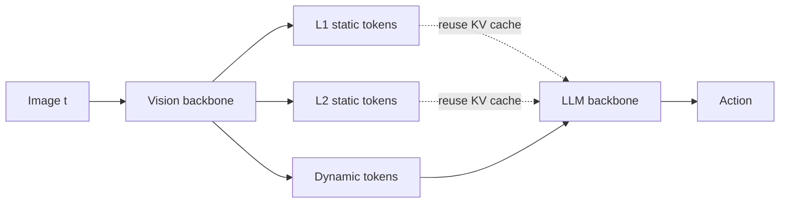

# DySta: Static-Dynamic Disentanglement for Efficient Multi-Frame VLA

> [!abstract] One-line
> Split visual tokens into **static** (reused across frames) and **dynamic** (recomputed each frame) so a VLA can see many past frames cheaply, and reuse the static KV-cache for **2× faster** inference.

## Problem

VLAs are built on big VLMs, which gives two pains:
1. **Limited context** → can only fit the current frame, so they are *memoryless* and fail on tasks needing temporal memory (e.g. "did I already press this button?").
2. **Slow inference** → quadratic attention + huge params → high per-step latency, bad for real-time control and RL rollouts.

> [!warning] Why prior caching tricks fail
> Methods like VLA-Cache / TTF assume **pixel-space similarity ⟹ latent-space invariance**. This is false in transformer backbones, so their heuristic reuse hurts performance.

## Key Idea

Real scenes are **mostly static** (background, idle objects). So disentangle each image's $N$ tokens into:

- **Multi-level static tokens** ($s_1, s_2, \dots$) — persist over time, kept as a *single copy* and reused.
- **Dynamic tokens** ($d$) — capture per-frame change (gripper, moving objects), recomputed every step.

This gives two wins:
1. **Multi-frame integration** — input = one copy of static tokens + dynamic tokens from many steps. Context shrinks from $NT$ → $NT - rN(T-1)$.
2. **Efficient inference** — reuse the **KV-cache** of static tokens, cutting LLM FLOPs by factor $1-r$.

## Method

- **Recache gate** $g_l \in [0,1]$: a lightweight MLP that decides per static level whether to **refresh** or **reuse** the cache, comparing current vs cached observation. Trained end-to-end with Gumbel-softmax; at inference refresh if $g_l > \delta_l$. (Refreshing L1 forces refreshing L2.) Overhead ≈ 1.27%.
- **Training losses:**
  - $\mathcal{L}_\text{InfoNCE}$ — contrastive: frames from same trajectory = positives → makes static tokens temporally stable yet informative.
  - $\mathcal{L}_\text{gate}$ — regularizes gate toward *reuse* via prior $p_\Delta = 1 - e^{-\lambda\Delta}$ (only recompute when $\Delta$ large), preventing the trivial "always refresh" solution.
  - $\mathcal{L} = \mathcal{L}_\text{Task} + \sum_l \alpha_l \mathcal{L}^l_\text{InfoNCE} + \beta \mathcal{L}_\text{gate}$

## LIBERO-Memory Benchmark

Existing sim benchmarks are *memoryless* (current frame suffices). New benchmark built on episodic-memory structure — 3 subtasks per episode testing:
- **Where** — return first can to its original spot (spatial memory).
- **When** — track heating time, remove at right moment (temporal memory).
- **What** — remember which can was already heated, pick the other (identity memory).

## Results

> [!success] Headline numbers
> - **+24.5%** avg on multi-frame integration (LIBERO-Memory); **+23.3%** real-world memory tasks.
> - **2.26×** speedup (+3.9% SR vs best baseline) on SimplerEnv.
> - **2.21×** speedup (+10.6% SR) on real-world general tasks.

- Beats temporal-reuse baselines (FlashVLA, TTF, VLA-Cache) on both SimplerEnv (CogACT base) and LIBERO (OpenVLA-OFT base) with far lower FLOPs.
- **Ablations:** removing contrastive loss, L2 cache level, or the learnable gate (fixed-interval refresh) each degrade performance → all components matter.
- **Attention viz:** dynamic tokens → gripper/moving objects; L1 static → background (sink-like, very stable); L2 static → semi-static objects (drawer, arm).

## Takeaways

> [!tip] Remember this
> Not all visual tokens deserve recomputation. **Disentangle static vs dynamic, keep one copy of static, KV-cache it, and learn *when* to refresh.** Cheap multi-frame memory + 2× faster inference.

- Limitation: built on *pretrained* VLAs; pretraining from scratch with this architecture may unlock more.
