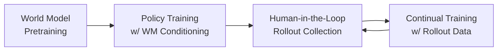

# GigaBrain-0.5M*: World Model-Based RL for Vision-Language-Action Models

## Problem

Standard VLA models predict action chunks directly from current observations, leading to two core limitations:
1. **Constrained scene understanding** — reactive control without prospective planning
2. **Weak future anticipation** — no mechanism to reason about long-horizon outcomes

This causes failures in complex, multi-step manipulation tasks (e.g., laundry folding, espresso preparation).

## Key Idea

Condition VLA policy actions on a **world model's predictions** (future visual states + value estimates) rather than observations alone. The framework is called **RAMP** (Reinforcement leArning via world Model-conditioned Policy).

> [!info] RECAP is a special case of RAMP
> RECAP ($\pi^*_{0.6}$) conditions on only a sparse binary advantage $I \in \{0,1\}$. RAMP additionally conditions on future latent states $\mathbf{z}$. Formally:
> $$\pi_{\text{RECAP}}(a|\mathbf{o},I) = \int_z \pi_{\text{RAMP}}(a|\mathbf{o},\mathbf{z},I)\,p(\mathbf{z}|\mathbf{o},I)\,d\mathbf{z}$$
> RECAP averages over all future evolutions; RAMP targets a specific predicted future.

## Method

### GigaBrain-0.5 Architecture

- **Backbone**: Mixture-of-Transformers with [[PaliGemma-2]] VLM encoder
- **Action head**: Diffusion Transformer (DiT) with flow matching → predicts action chunks
- **Embodied CoT**: generates subgoal language + discrete action tokens + 2D trajectory keypoints
- **Loss**: CoT cross-entropy + diffusion flow matching + GRU trajectory regression

### RAMP: 4-Stage Pipeline

**Stage 1 — World Model Pre-training**
- Backbone: **Wan2.2** (video DiT), trained with flow matching
- Predicts future visual states $\{o_{t+12}, o_{t+24}, o_{t+36}, o_{t+48}\}$ and value $v_t$ jointly
- Latent state: $\mathbf{s}_t = [\mathbf{z}_t\,;\,\Psi(v_t)\,;\,\Psi(\mathbf{p}_t)]$ — value/proprioception tiled to match spatial dims
- Reward: $r_t = 0$ (success), $-C_{\text{fail}}$ (failure), $-1$ (otherwise)
- Trained on 4K hours real robot data

**Stage 2 — Policy Training with World Model Conditioning**
- Initializes from GigaBrain-0.5 checkpoint
- Policy conditioned on $(I, \mathbf{z}_{\text{future}})$ where $I = \mathbf{1}[A > \epsilon]$ (advantage indicator)
- Advantage from $n$-step TD: $A(\mathbf{s}_t, a_t) = \sum_k \gamma^k r_{t+k} + \gamma^n v_{t+n} - v_t$
- **Stochastic attention masking** ($p=0.2$): randomly drops WM tokens → robustness if WM unavailable

**Stage 3 — Human-in-the-Loop Rollout (HILR)**
- Deploy policy on real robots; human expert intervenes on failures
- Custom software removes temporal artifacts at intervention boundaries
- Produces hybrid dataset: autonomous successes + corrected failures

**Stage 4 — Continual Training**
- Fine-tune policy on HILR data; jointly update world model (prevents advantage collapse)
- Iterative loop: better policy → better rollouts → better training data

**Inference modes:**
- *Efficient*: bypass WM (mask future tokens), use $I=1$
- *Standard*: run WM for dense look-ahead guidance, use $I=1$

### Theoretical Justification

Optimal KL-regularized RL policy in augmented state space $\mathbf{S} = (\mathbf{o}, \mathbf{z}, l)$:
$$\hat{\pi}(a|\mathbf{S}) \propto \pi_{\text{ref}}(a|\mathbf{S})\exp\!\left(\frac{A^{\pi_{\text{ref}}}(\mathbf{S},a)}{\beta}\right)$$

Training objective (weighted negative log-likelihood):
$$\mathcal{L}(\theta) = \mathbb{E}_D\!\left[-\log\pi_\theta(a|\mathbf{o},\mathbf{z},l) - \alpha\log\pi_\theta(a|I,\mathbf{o},\mathbf{z}_t,l)\right]$$

## Why It Works

- **Dense information**: future state latent $\mathbf{z}$ injects geometric/physical priors vs. RECAP's 1-bit advantage → lower conditional entropy $H(a|\mathbf{o},\mathbf{z},I) \leq H(a|\mathbf{o},I)$
- **Joint value+state prediction**: outperforms value-only or VLM-based value prediction (Kendall $\tau = 0.8018$ vs $0.7972$ / $0.7288$)
- **HILR data quality**: autonomous rollouts reduce action distribution gap compared to pure teleoperation

## Weakness

- **Computational cost**: world model inference adds ~0.25s latency (vs. 0.11s for value-only)
- **World model quality bottleneck**: policy improvement is gated by how accurately the WM predicts future states
- **Human-in-the-loop dependency**: Stage 3 still requires expert intervention — not fully autonomous
- **Single-step WM denoising**: uses only 1 denoising step at inference for speed — potential quality trade-off

## Experiments

| Method                              | Setting                  | Key Result                                                     |
| ----------------------------------- | ------------------------ | -------------------------------------------------------------- |
| GigaBrain-0.5 vs π₀.₅               | 8 internal tasks         | +10–20% on Box Packing, Espresso Prep                          |
| GigaBrain-0.1                       | RoboChallenge (30 tasks) | **51.67%** avg success rate, **#1** on leaderboard (Feb 2026)  |
| RAMP vs RECAP                       | 3 hard tasks             | **~30% improvement** on Box Packing, Espresso, Laundry Folding |
| WM (state+value) vs VLM-based value | Value prediction         | MAE 0.0621 vs 0.0683, Kendall 0.8018 vs 0.7972                 |

Multi-task training with WM conditioning shows progressively larger gains over baseline (up to ~30% at 20K steps for Box Packing).

## My Ideas

- Can the world model's future state prediction be used for **online replanning** mid-trajectory?
- The stochastic masking idea is similar to [[dropout]] for conditioning — could apply to other conditional policies
- HILR loop resembles [[DAgger]] but with the policy generating its own distribution — worth connecting
- Could RAMP's formulation apply to [[diffusion policy]] beyond VLAs?
- World model trained on video data — could web video pretraining (Wan2.2 style) reduce reliance on robot data?

## Connections

- [[RECAP]] / [[pi0.6]] — advantage-conditioned RL baseline; RAMP generalizes it
- [[PhD-Research/Papers/Pi0]] / [[pi0.5]] — strong VLA baselines from Physical Intelligence
- [[GR00T]] / [[GR-3]] — competing VLA systems
- [[Cosmos]] — world model for robot policy (cosmospolicy uses latent frame injection, same idea)
- [[DAgger]] — online imitation learning; HILR is spiritually related
- [[AWR]] — offline RL baseline compared against
- [[Wan2.2]] — video generation backbone used for world model
