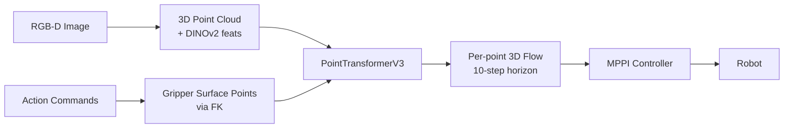

# PointWorld: Scaling 3D World Models for In-The-Wild Robotic Manipulation

**Links:** [arXiv 2601.03782](https://arxiv.org/abs/2601.03782) · [Project Page](https://point-world.github.io/) · [GitHub](https://github.com/huangwl18/PointWorld)
**Authors:** Wenlong Huang, Yu-Wei Chao, Arsalan Mousavian, Ming-Yu Liu, Dieter Fox, Kaichun Mo, Li Fei-Fei
**Venue:** arXiv preprint · 2026

---

## Problem

框图
Robot manipulation policies fail to generalize in-the-wild — especially in cluttered environments. Most existing world models are image-based, which limits their geometric reasoning.

> [!idea] Core Idea
> Represent both **state and action as 3D point flows** in a shared point cloud space. Given RGB-D images + robot action commands, PointWorld forecasts **per-point 3D displacements** over a 10-step horizon in a single forward pass.

---

## Method

### Scene Representation
- RGB-D back-projected to a **3D point cloud** (robot pixels masked via FK)
- Points carry frozen **DINOv3** features for semantic grounding

### Action Representation
- **300–500 gripper surface points** sampled from URDF, propagated via FK
- Stays observable even under occlusion

### Model
| Component | Detail |
|-----------|--------|
| Backbone | [[PointTransformerV3]] (PTv3) |
| Scale | 957× parameter scaling over prior baselines |
| Output horizon | 10-step chunked (single forward pass, ~0.1 s) |

### Training Objectives
- **Movement weighting** — emphasize moving points to handle sparse signal

### Dataset
- ~2M trajectories / 500 hours total
  - **DROID** — 200 h real teleoperation, annotated via FoundationStereo + VGGT + CoTracker3
  - **BEHAVIOR-1K** — 300 h simulation

### Inference
MPPI samples EEF trajectories → rolls out dynamics with PointWorld → refines via importance weighting. Goals specified by GUI point selection.

---

## Why It Works

> [!success] Strengths
> - **Geometry-aware** — 3D point flow captures spatial structure that 2D images miss
> - **Embodiment-agnostic** — point cloud representation is not robot-specific
> - **No demonstrations needed** — MPC planning from a world model rollout
> - **Semantic grounding** — DINOv3 provides objectness priors without explicit segmentation

---

## Limitations

> [!warning] Weaknesses
> - Requires ==RGB-D== — fails on transparent/reflective objects or in poor lighting
> - **Static scene assumption** — dynamic environments are unaddressed
> - Dense correspondence supervision is noisy for deformable objects or fast motions
> - MPC error accumulates over long horizons
> - Goal specification requires manual GUI point selection per task
> - No explicit physics priors — purely data-driven; correlation ≠ causation

---

## Experiments

> [!example] Key Results
> - **Tasks:** rigid pushing, deformable manipulation, articulated objects, tool use — **single checkpoint, zero demonstrations**

### Ablations
| Choice | Winner |
|--------|--------|
| Action representation | Gripper-only flows > whole-body or low-dim |
| Prediction mode | 10-step chunked > autoregressive |

---

## My Ideas

- Use frozen PointWorld backbone embeddings as observations for **diffusion policies** ([[Diffusion Policy]])
- Use PointWorld rollouts as planning primitives for a higher-level task planner ([[World Model for Manipulation]])

---

## Connections

- [[Diffusion Policy]] — could use PointWorld features as richer observations
- [[RT-2]] — also targets generalization but stays in 2D VLM space
- [[ACT]] — imitation learning baseline; PointWorld enables MPC without demos
- [[PointTransformerV3]] — backbone enabling massive scale

#world-model #3d-representation #point-cloud #scaling #robot-manipulation
